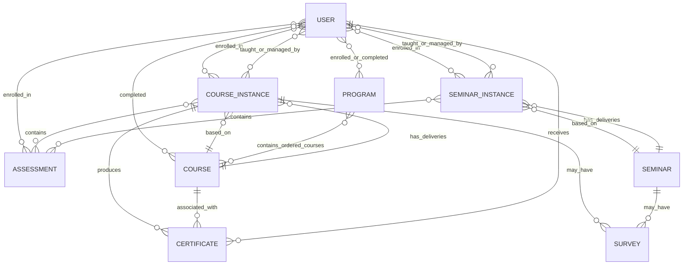

# Current LMS Map

## 1. Scope and evidence

This map is based only on the eight supplied Mongoose models:

- `User`
- `Course`
- `CourseInstance`
- `Program`
- `Seminar`
- `SeminarInstance`
- `Certificate`
- `Survey`

The following referenced models were not supplied: `Assessment`, `Category`, and the constants that define `ROLES`, `CONTENT_TYPES`, and `EXAM_TYPES`. Controllers, services, routes, and the front-end were also not supplied. Therefore, this document separates what the schemas **confirm** from what can only be **inferred**.

## 2. High-level system picture

The LMS has four main layers:

1. **Users and roles** - learners, teachers, content managers, and possibly administrators.
2. **Learning catalog** - reusable course and seminar templates.
3. **Learning delivery** - course and seminar instances with dates, participants, teachers, lessons, links, and reminders.
4. **Outcomes and feedback** - lesson completion, course/program completion, assessments, certificates, and surveys.

The clearest distinction in the data model is between a reusable learning item and a concrete delivery of that item:

- `Course` -> reusable course template
- `CourseInstance` -> a particular run or delivery of the course
- `Seminar` -> reusable seminar template
- `SeminarInstance` -> a particular scheduled delivery of the seminar

Actual calendar dates belong to the instance models, not the template models.

## 3. Entity relationship map

`Assessment` is shown because it is referenced by the supplied models, although its schema was not included.

## 4. Model-by-model map

### 4.1 `User`

**Purpose:** Represents an LMS account and its relationships to learning activities.

**Confirmed capabilities:**

- Unique email account with an optional password.
- Passwords are hashed before saving.
- Account verification status.
- Privacy flag.
- One or more roles from a predefined role list.
- Learner relationships:
  - enrolled course instances;
  - enrolled seminar instances;
  - enrolled assessments;
  - successfully completed courses;
  - enrolled programs;
  - completed programs;
  - received certificates.
- Staff relationships:
  - managed course and seminar instances;
  - taught course and seminar instances.
- Teacher profile information in English and Bulgarian.
- General profile information, avatar, and phone number.

**Important for gamification:**

- The model identifies the learner and exposes existing completion/enrollment relationships.
- It contains a `private` flag that should be respected by public leaderboards or social features.
- It has no XP, level, badge, streak, rank, or gamification preferences.
- The model must remain unchanged, so gamification data should be stored in new models that reference `User`.

---

### 4.2 `Course`

**Purpose:** Reusable course definition or catalog template.

**Confirmed capabilities:**

- Unique course identifier (`cid`) and name.
- Active and visible states.
- Category and subcategory references.
- English and Bulgarian descriptions.
- Marketing/detail content such as:
  - long description;
  - learning objectives;
  - topics;
  - outcomes;
  - target audience.
- Structured content blocks with a content type, content value, and language.
- Curriculum made of sections and lessons.
- Course prerequisites referencing other courses.
- References to its course instances and certificates.
- Cover image.
- List of users who successfully completed the course.
- Paid/free settings, price, and currency.
- Creation timestamp.

**Important distinction:**

`Course` is a template. It deliberately does not own actual start/end dates. The comments state that real dates are calculated and stored on `CourseInstance`.

**Important for gamification:**

- Course-level achievements can reference the stable `Course` template.
- The completion list can trigger a course completion reward.
- Prerequisite relationships can support progression or learning-path achievements.
- The nested prerequisite structure exists, but its exact business meaning is not explained by the schema alone.

---

### 4.3 `CourseInstance`

**Purpose:** A concrete delivery of a course to a group or individual learners.

**Confirmed capabilities:**

- Unique instance identifier and name.
- Schedule data:
  - start date;
  - end date;
  - start time;
  - session duration;
  - lesson days;
  - per-curriculum-section start/end date-time.
- `isLive` flag, which explicitly distinguishes live and non-live/self-paced course instances.
- Public, featured, tracked, active, and visible states.
- Curriculum copied into the instance.
- Each lesson may reference an assessment.
- **Lesson completion tracking:** each lesson contains a `completedBy` list with user and completion timestamp.
- Instance-wide exam references.
- Certificate support and a `hasCertificate` flag.
- Enrolled users.
- Teachers and content managers.
- Reference to the source `Course` template.
- Course/lecture URLs and Slido codes.
- Paid-course fields and per-user payment records.
- Configurable email reminders:
  - day before;
  - day of;
  - one hour before each lecture.
- Reminder timestamps used to prevent duplicate sending.

**Important for gamification:**

This is the strongest source of fine-grained learner activity in the supplied models because it records lesson completion with timestamps.

Potential confirmed event sources include:

- course-instance enrollment;
- lesson completion;
- completion time;
- assessment association;
- course delivery type (`isLive`);
- teacher/content-manager assignment;
- certificate issuance through related models.

**Not confirmed:**

- Attendance at live sessions.
- Whether opening a lesson counts as activity.
- Assessment attempts, score, pass/fail, or completion rules.
- The exact rule that turns completed lessons into a successfully completed course.

---

### 4.4 `Program`

**Purpose:** A structured learning path made from multiple courses.

**Confirmed capabilities:**

- Unique identifier and multilingual name/description.
- Ordered list of course templates.
- Per-course prerequisites inside the program.
- Difficulty: beginner, intermediate, or advanced.
- Estimated duration in weeks.
- Category/subcategory, image, and icon.
- Learning outcomes, target audience, requirements, and career paths.
- Visible and featured states.
- Enrollment records with timestamps.
- Completion records with timestamps.
- Calculated total course count.
- Methods that:
  - calculate progress as the percentage of program courses completed;
  - find the next available course based on order and prerequisites;
  - prevent duplicate program enrollment;
  - determine whether all program courses are completed.

**Important for gamification:**

- Program progress already has a clear percentage calculation.
- Milestones can be awarded for first course, halfway point, final course, or full program completion.
- The next-course method can support guided quests or journey progression.
- Program completion depends on completed `Course` templates, not on a particular course instance.

---

### 4.5 `Seminar`

**Purpose:** Reusable seminar definition or catalog template.

**Confirmed capabilities:**

- Unique identifier and English/Bulgarian name and description.
- Active and visible states.
- Category/subcategory.
- Structured content blocks.
- Curriculum with sections and lessons.
- Section URLs and Slido codes.
- References to seminar instances.
- Cover image and creation timestamp.

**Important distinction:**

Like `Course`, `Seminar` is a template. Actual delivery dates belong to `SeminarInstance`.

**Important for gamification:**

- Seminar participation rewards could reference this stable template.
- The template itself does not track attendance, lesson completion, or successful seminar completion.

---

### 4.6 `SeminarInstance`

**Purpose:** A concrete scheduled delivery of a seminar.

**Confirmed capabilities:**

- Instance name and unique identifier.
- Start/end dates, start time, session duration, and lesson days.
- Public, featured, active, and visible states.
- Curriculum with per-section schedule data.
- Lesson-level assessment references.
- Enrolled users.
- Teachers and content managers.
- Reference to the source `Seminar`.
- URLs and Slido codes.
- Reminder emails for day-before, day-of, and hour-before events.
- Per-instance and per-lecture reminder deduplication timestamps.

**Important for gamification:**

- Enrollment and scheduled participation are visible.
- Lesson assessment associations are visible.
- The supplied schema does **not** record attendance, lesson completion, seminar completion, or certificate issuance.
- A reliable “attended seminar” badge cannot be awarded from this model alone unless another service/model records attendance elsewhere.

---

### 4.7 `Certificate`

**Purpose:** Represents a certificate issued to a learner for a course.

**Confirmed capabilities:**

- Required certificate identifier.
- Issue date.
- Required score from 0 to 100.
- Reference to the receiving user.
- Reference to the relevant course instance.
- Reference to the course template.

**Important for gamification:**

- Certificate issuance is a strong, meaningful achievement event.
- Score-based achievements are technically possible because the score is stored.
- The model does not explain the passing threshold, how the score is calculated, or whether certificates can be revoked/reissued.

---

### 4.8 `Survey`

**Purpose:** Collects feedback or answers from users during a defined active period.

**Confirmed capabilities:**

- Survey name.
- Active-from and active-until dates.
- Flexible question collection.
- Flexible answer collection, including user answers and a user reference-like value.
- Optional association with a course instance.
- Optional association with a seminar template.
- Participant list.

**Important for gamification:**

- Survey participation could support a feedback/contribution reward.
- Rewarding survey completion needs anti-abuse rules because the answer structure is very flexible.
- The schema associates surveys with `Seminar`, not `SeminarInstance`; whether that is intentional is unclear.
- User references in answers/participants are stored as strings rather than `ObjectId`, so identity handling may differ from the other models.

## 5. Main user and staff roles

The exact role names are unavailable because the `ROLES` constant was not supplied. The relationships nevertheless reveal several functional personas.

### Learner

Can be associated with:

- course-instance enrollment;
- seminar-instance enrollment;
- assessment enrollment;
- lesson completion in course instances;
- successfully completed courses;
- program enrollment and completion;
- certificates;
- surveys.

### Teacher

Can have:

- teacher profile information;
- taught course instances;
- taught seminar instances.

### Content manager

Can be assigned to:

- managed course instances;
- managed seminar instances.

### Administrator or other roles

Likely exist because roles are configurable, but their exact permissions cannot be derived from these models.

## 6. Core LMS workflows

### 6.1 Course authoring and delivery

1. A reusable `Course` is created with descriptions, curriculum, prerequisites, and catalog information.
2. A `CourseInstance` is created from or linked to the course.
3. The instance receives real dates, lesson times, delivery type, teachers, content managers, and enrolled users.
4. Learners complete lessons; completion is stored per lesson with a timestamp.
5. Assessments or exams may be attached, but their behavior is defined outside the supplied files.
6. Successful course completion is stored against both users and the course template.
7. A certificate may be issued with a score.

### 6.2 Live-course flow

A course instance with `isLive: true` can have:

- scheduled lesson date-times;
- session duration;
- meeting/content URL;
- Slido code;
- day-before, day-of, and hour-before reminders.

The model supports scheduling and communication, but not confirmed attendance tracking.

### 6.3 Self-paced-course flow

A course instance with `isLive: false` represents the clearest available mechanism for a self-paced course.

It can still contain:

- lessons and content;
- lesson assessments;
- lesson completion records and timestamps;
- enrolled users;
- exams and certificates.

The schema still contains schedule fields, so the exact way they are used or ignored for self-paced instances depends on application logic not supplied here.

### 6.4 Seminar flow

1. A reusable `Seminar` is created.
2. A scheduled `SeminarInstance` is created with participants, teachers, schedule, URLs, and reminders.
3. Lessons may reference assessments.
4. No supplied field confirms attendance or successful completion.

### 6.5 Program flow

1. A program is created from ordered courses.
2. A user enrolls.
3. Program progress is derived from the user's successfully completed course templates.
4. The next course is selected by order and prerequisite satisfaction.
5. Completion occurs when every course in the program is completed.

### 6.6 Survey flow

1. A survey becomes active between two dates.
2. It may be linked to a course instance or seminar template.
3. Users are listed as participants and can submit answers.

## 7. Existing progress and achievement signals

The supplied models already expose these possible gamification triggers:

| Signal | Where it exists | Reliability from supplied models |
|---|---|---|
| User enrolls in a course instance | `User`, `CourseInstance` | High, but duplicated on both sides |
| User enrolls in a seminar instance | `User`, `SeminarInstance` | High, but duplicated on both sides |
| User completes a course lesson | `CourseInstance.curriculum.lessons.completedBy` | High |
| User completes a course | `User`, `Course` | High, but duplicated on both sides |
| User enrolls in a program | `User`, `Program` | High, but duplicated on both sides |
| User completes a program | `User`, `Program` | High, but duplicated on both sides |
| Program progress percentage | `Program.calculateProgress()` | High |
| User receives a certificate | `Certificate`, `User`, `CourseInstance`, `Course` | High, but references are duplicated |
| Certificate score | `Certificate.score` | High |
| User participates in a survey | `Survey` | Medium; flexible schema and string IDs |
| User completes an assessment | Referenced `Assessment` model | Unknown; model not supplied |
| User attends a live class | Not present | Unavailable |
| User completes a seminar | Not present | Unavailable |
| Login/activity streak | Not present | Unavailable |
| Time spent learning | Not present | Unavailable |

## 8. Data duplication and source-of-truth concerns

Several relationships are stored on both sides:

- user enrollment and instance enrollment;
- user course completion and course completed-user list;
- user program enrollment/completion and program user lists;
- user certificate list and certificate references from courses/instances.

This likely makes querying convenient, but the supplied schemas do not state which side is authoritative or how synchronization is guaranteed.

For gamification, rewards should be triggered by a single authoritative business event rather than by independently watching both copies. Otherwise, one action could award points twice.

Recommended requirement wording:

> A gamification reward must be processed through an idempotent event or transaction identified by user, event type, and source entity. Repeated updates to mirrored LMS fields must not produce duplicate rewards.

## 9. Gaps that affect gamification design

The following information is not available in the supplied files:

- Exact role names and permissions.
- Assessment structure, attempts, scores, and pass/fail rules.
- Course completion calculation.
- Live attendance or punctuality.
- Seminar completion.
- Login history or daily learner activity.
- Time spent in content.
- Study Group membership, group communication, Collaborative Challenge definitions, contributions, assignments, or submissions.
- Post-course Knowledge Refresher schedules, attempts, responses, and topic-level results.
- Skill taxonomy, mastery, or recommendation data.
- Notification delivery beyond course/seminar reminders.
- Administrative UI and learner-facing UI.
- Which duplicated relationship is the source of truth.
- Whether records can be deleted, revoked, or corrected.

These gaps should become explicit assumptions or exclusions in the gamification requirements.

## 10. Safe conclusions for the assignment

Based on the supplied files, the gamification design can safely use:

- course-instance enrollment;
- course lesson completion and completion timestamp;
- successful course completion;
- program progress and completion;
- certificate issuance and certificate score;
- course type: live or self-paced;
- survey response/participation, with additional validation rules.

The design should not claim that the LMS currently tracks:

- attendance;
- punctuality;
- seminar completion;
- daily learning activity;
- time spent;
- assessment outcomes.

Those features would require a new extension model, additional event tracking, or the missing `Assessment` model.

## 11. Suggested extension boundary

The supplied models should be treated as closed. A gamification subsystem should add separate models that reference existing records, for example:

- `GamificationProfile` -> references `User`
- `PointTransaction` -> references `User` and an originating LMS entity
- `AchievementDefinition`
- `UserAchievement` -> references `User` and an achievement
- `StudyGroup` and `StudyGroupMembership`
- `Challenge` and `ChallengeProgress`
- `KnowledgeRefresherDefinition` and `KnowledgeRefresherAttempt`
- `ActivityEvent` or another trusted event ledger
- `LeaderboardSnapshot` for optional competitive features

No XP, badges, levels, or streak fields need to be added to `User`, `Course`, or `CourseInstance`.

## 12. Final current-state summary

The LMS is built around reusable course/seminar templates and scheduled or self-paced instances. It already tracks users, enrollments, course lesson completion, successful course completion, program progress, certificate scores, and surveys. Course instances explicitly distinguish live from non-live delivery. The strongest gamification events are lesson completion, course completion, program milestones, and certificate issuance. Attendance, seminar completion, Study Groups, Collaborative Challenges, Post-course Knowledge Refreshers, general activity, detailed assessment outcomes, and Skill Profile data are not available from the supplied models and must not be assumed.
