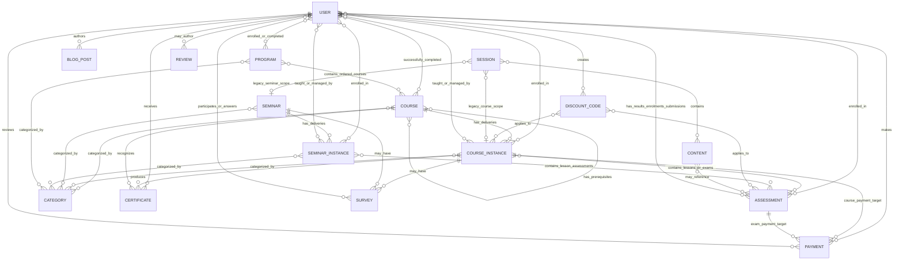

# Entity Relationship Map

## 1. Core entity map

The diagram shows durable model references in the supplied mock-up. Several relationships are mirrored on both entities; these are described after the diagram.

## 2. Model inventory

| Model | Main purpose | Current workflow status |
|---|---|---|
| `User` | Account, roles, learner and staff relationships | Active |
| `Course` | Reusable course template | Active |
| `CourseInstance` | Concrete live or self-paced course delivery | Active |
| `Seminar` | Reusable seminar template | Active |
| `SeminarInstance` | Concrete seminar delivery | Active |
| `Program` | Ordered multi-course learning path | Active |
| `Assessment` | Lesson assessment, quiz exam, practical exam, results and submissions | Active |
| `Certificate` | Issued course certificate with final score | Active |
| `Category` | Catalogue classification | Active |
| `Payment` | Course or exam bank-transfer payment | Active |
| `DiscountCode` | Course/exam discount configuration | Active |
| `BlogPost` | Public/admin blog content | Active, not a learning-evidence source |
| `Survey` | Flexible questions, answers, participants | Model exists; no main route was found |
| `OTP` | Verification/password-reset code storage | Active authentication support |
| `Content` | Standalone content with assessment references | Dormant/legacy relative to nested curricula |
| `Session` | Content grouping with course/seminar references | Dormant/legacy; includes a lower-case `courseInstance` ref name |
| `Review` | User-linked review data | Model exists; no main route was found |

## 3. Embedded learning evidence

Not every important relationship is a top-level collection.

### `CourseInstance.curriculum[].lessons[]`

Each lesson may contain:

- content blocks copied into the instance;
- an `Assessment` reference;
- `completedBy[]` entries containing learner and completion timestamp.

This is the current fine-grained course-progress source.

### `Assessment.results[]`

Each result may contain:

- learner;
- start and completion timestamps;
- score and grade;
- pass-score snapshot;
- question, correct-answer, and failed-answer counts;
- submitted answers.

### `Assessment.examSubmissions[]`

Practical exams store one current submission row per learner, including the original and stored filenames, size, and submission time. A re-upload replaces the learner's earlier row before the window closes.

### `Program.enrolledUsers[]` and `completedByUsers[]`

Program relationships include timestamps, while percentage progress is calculated from the user's successfully completed Course templates.

## 4. Mirrored relationships and source-of-truth risk

The following relationships appear on more than one model:

- learner ↔ Course Instance enrollment;
- learner ↔ Seminar Instance enrollment;
- learner ↔ Assessment enrollment;
- learner ↔ successfully completed Course;
- learner ↔ Program enrollment/completion;
- learner/Course/Course Instance ↔ Certificate.

This supports convenient querying but creates duplicate-award risk. Gamification must consume one authoritative event from the service that completes the transaction, not independently react to every changed array.

## 5. Relationship consequences for gamification

- Course-instance scope is the natural boundary for Course Progress, Exam Readiness, Study Groups, and most Collaborative Challenges.
- Course-template scope is appropriate for durable course-completion and certificate achievements.
- Program scope is appropriate for multi-course milestones.
- Assessment scope is appropriate for attempt, completion, pass, practical-submission, and exam evidence.
- User privacy and role data must be checked before exposing social or competitive information.
- Blog posts, authentication actions, payments, and raw website activity are not meaningful learning evidence by themselves.
